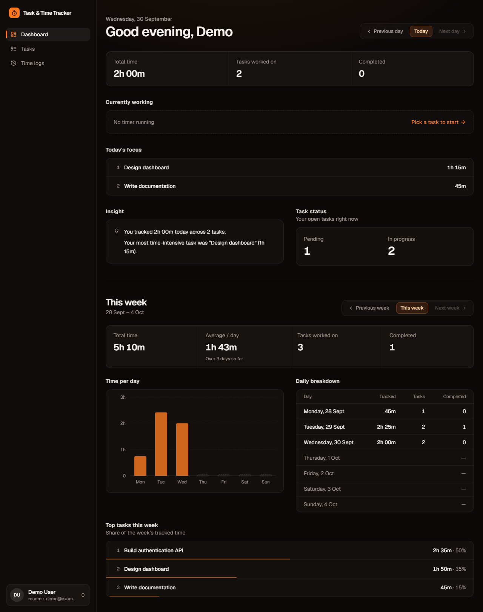
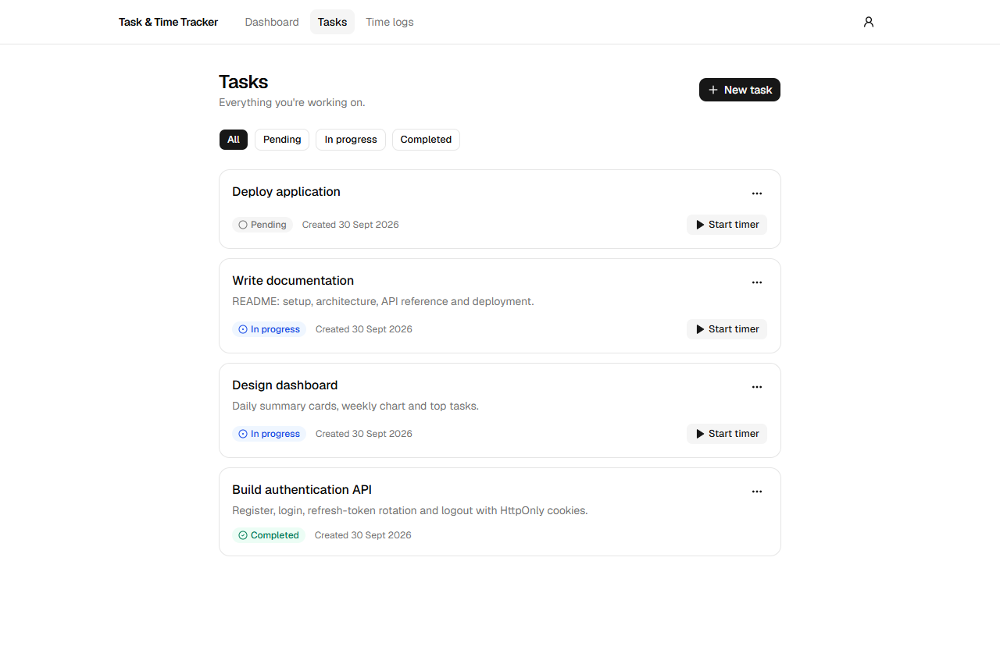
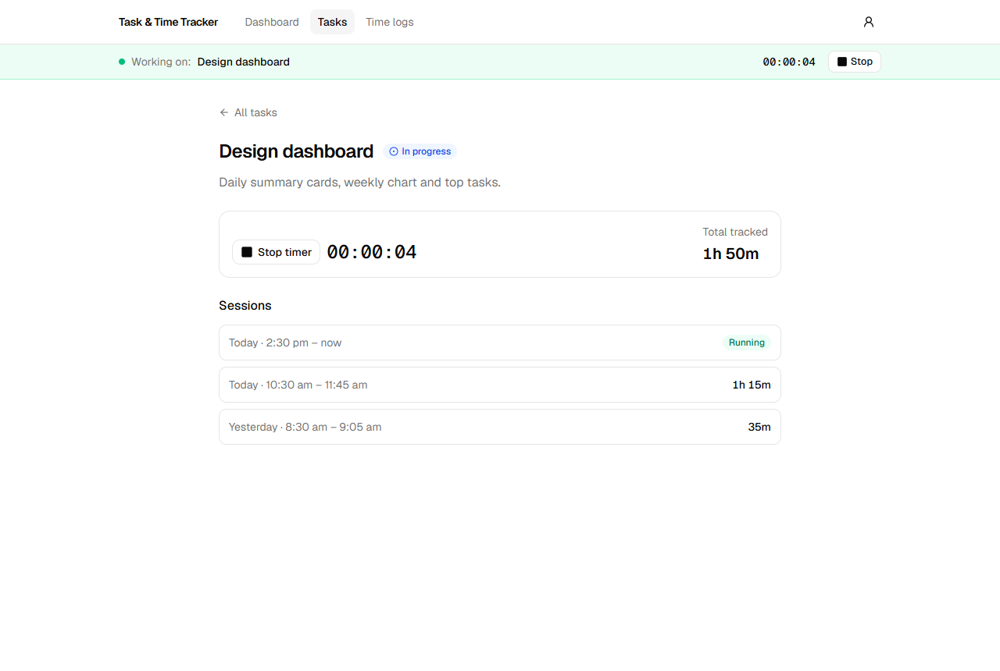
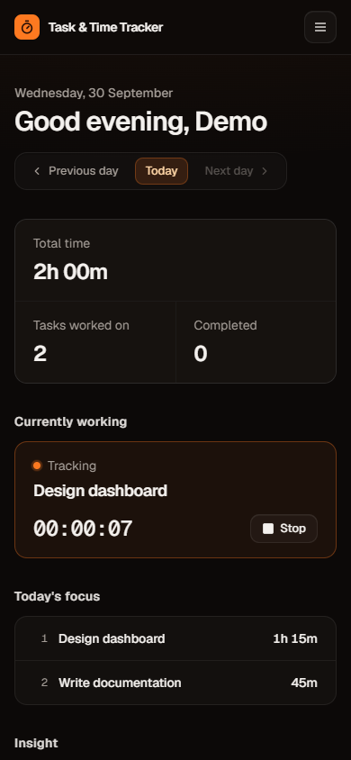

# Task & Time Tracker

Capture tasks, track focused work, and understand where your time goes.

## Overview

A personal-productivity web app built as a technical evaluation project: a Next.js frontend and an Express REST API over PostgreSQL. Users write tasks (optionally tidied up by an AI assistant), time their work with a server-owned timer, and review daily and weekly productivity figures computed in SQL.

The focus is engineering quality rather than feature count: strict per-user data isolation, invariants enforced by the database, timezone-correct analytics, an AI integration that can only suggest, and production hardening (validation, standardized errors, rate limits, structured logs, health checks, graceful shutdown, CI, OpenAPI docs).

- **Live demo:** see [Live Demo](#live-demo) · **5-minute tour:** [docs/EVALUATION.md](docs/EVALUATION.md) · **Deploying:** [docs/DEPLOYMENT.md](docs/DEPLOYMENT.md)



### Engineering Highlights

- **HttpOnly cookie sessions:** short-lived access JWT plus an opaque refresh token that rotates on every use; JavaScript never sees either.
- **Hashed refresh tokens:** only a SHA-256 hash is stored; rotation is a conditional update, so a replayed or raced token can't mint a second session.
- **Resource-level authorization:** every query carries the owner's `userId`; another user's task is a 404 indistinguishable from a missing one, tested in both directions for every endpoint.
- **Server-authoritative timer:** the server sets every timestamp and duration; the client only renders `now − anchor` from a server-computed elapsed time.
- **Database-enforced invariants:** a partial unique index guarantees one running timer per user, even under concurrent requests; CHECKs keep durations and `completedAt` consistent.
- **PostgreSQL aggregation:** daily and weekly analytics are computed in SQL with timezone-correct, midnight-splitting day windows; the browser receives a small JSON summary.
- **Zod everywhere:** one schema per request, shared by the API, the web forms and the OpenAPI document; a contract test checks real responses against the docs.
- **Structured error handling:** one error envelope, stable error codes, generic 500s (never Prisma/SQL text) and request ids that tie UI errors to server logs.
- **Automated CI:** migration-drift check, typecheck, lint, format, unit and integration tests on real PostgreSQL, and a production build on every PR.
- **AI behind an abstraction:** the provider returns untrusted data that is validated, time-limited and rate-limited; the AI suggests, and the user decides.

## Core Features

- **Accounts:** register, log in, log out; HttpOnly cookie sessions (15-minute access token, rotating 7-day refresh token).
- **Tasks:** create, edit, delete; `PENDING → IN_PROGRESS → COMPLETED` with guarded transitions; status filter and pagination.
- **AI task assistant** (optional): turns a rough note into a clear title and description; the user reviews and edits before anything is saved.
- **Time tracking:** one running timer per user; a live clock that survives refresh, navigation and sleep; per-task session history and totals.
- **Daily summary:** time tracked, tasks worked on, completions, open workload, top tasks and plain-language insights for any past day.
- **Weekly analytics:** Monday–Sunday totals, average per day, a per-day chart and table, and top tasks with their share of the week; shareable via `?week=`.

## Why This Project

Time tracking looks simple but hides real engineering problems: a timer must stay correct across tabs, devices and clock drift; two requests must never start two timers; a session that crosses midnight belongs to two days; one user must never see another's data; and analytics must be derived from trustworthy history, not recomputed in the browser. Each of those is solved at the layer that can guarantee it, and covered by tests.

## Architecture

```text
                  Next.js (apps/web)
                         │
                         │ HTTPS · JSON · HttpOnly cookies
                         ▼
                Express REST API /api/v1
                         │
        ┌────────────────┼────────────────┐
        ▼                ▼                ▼
      Auth             Tasks          Dashboard
                         │           (daily + weekly)
                         ▼
                   Time Tracking
                         │
                         ▼
             PostgreSQL (Prisma migrations)
          FKs · CHECKs · partial unique index

                 AI Provider (optional)
     ◄── Task suggestion only; never touches the database
```

- **Layers:** every module is `routes → controller → service → repository` (plus `schema`, `types`, `errors`). Controllers never touch the database, services never import Prisma, `userId` never comes from request input, and repositories never fetch a task or log by id alone. `tests/unit/architecture.test.ts` enforces these rules.
- **Request lifecycle:** request id → logger → security headers → CORS → size limits → cookies → Origin check → rate limit → authenticate → validate → controller → service → repository. One error handler emits the standard error envelope.
- **Frontend:** the TanStack Query cache is the only client copy of server state. Mutations invalidate the affected queries. Nothing is computed in React that the API already computes.
- **Production:** frontend and API deploy separately against managed PostgreSQL. When they are on different sites, the web app proxies `/api/v1` so auth cookies stay first-party ([details](docs/DEPLOYMENT.md#1-choose-a-topology)).

## Tech Stack

| Layer    | Choices                                                                                                        |
| -------- | -------------------------------------------------------------------------------------------------------------- |
| Frontend | Next.js 16 (App Router), React 19, TypeScript, Tailwind CSS v4, shadcn/ui (Base UI), TanStack Query, RHF + Zod |
| Backend  | Node.js 20+, Express 5, TypeScript, Zod, Prisma 6, Argon2id, JWT, pino, helmet, express-rate-limit             |
| Database | PostgreSQL 14+                                                                                                 |
| AI       | Anthropic SDK behind a provider-agnostic interface (optional)                                                  |
| Docs     | OpenAPI 3 generated from the Zod schemas, Swagger UI                                                           |
| Tooling  | npm workspaces, Vitest + Supertest (real PostgreSQL), ESLint, Prettier, GitHub Actions                         |

## Project Structure

```text
task-time-tracker/
├── apps/
│   ├── web/                     # Next.js frontend
│   │   ├── app/                 # routes; (app)/ = signed-in shell
│   │   ├── features/            # auth/, tasks/, time-tracking/, dashboard/ → api/, hooks/, components/
│   │   ├── components/          # shadcn/ui primitives, app shell
│   │   └── lib/api/             # fetch client (cookies, silent refresh) + one error-message policy
│   └── api/                     # Express backend
│       ├── prisma/              # schema.prisma, migrations/ (incl. hand-written SQL), seed.ts
│       ├── src/modules/         # auth/, tasks/ (+ ai/), time-tracking/, dashboard/
│       ├── src/{config,lib,middleware,routes,docs}/
│       └── tests/               # unit/, api/, authorization/
├── packages/shared/             # contracts shared by both apps: Zod request schemas, response types, formatters
├── scripts/smoke-test.sh        # end-to-end check of a running deployment
├── docs/                        # DEPLOYMENT.md, EVALUATION.md
└── .github/workflows/ci.yml
```

## Database Design

```text
User 1──N Task 1──N TimeLog        User 1──N TimeLog        User 1──N Session
```

- **User:** UUID, name, unique lowercased email, Argon2id hash. **Session:** SHA-256 of the refresh token, `expiresAt`, `revokedAt`.
- **Task:** title, description, status, `completedAt` (set by the server on completion, cleared on reopen).
- **TimeLog:** `startedAt`, nullable `stoppedAt` (null = running), `durationSeconds`.
- All timestamps are `timestamptz`. Deletes cascade `User → Task → TimeLog` and `User → Session`.
- Indexes match real queries: tasks `(userId, createdAt)`, `(userId, status, createdAt)`, `(userId, completedAt)`; logs `(userId, startedAt)`, `(taskId, startedAt)`, `(userId, stoppedAt)`.

| Invariant (enforced by PostgreSQL) | Mechanism                                                         |
| ---------------------------------- | ----------------------------------------------------------------- |
| At most one running timer per user | Partial unique index `("userId") WHERE "stoppedAt" IS NULL`       |
| A log's user owns its task         | Composite FK `("taskId","userId") → Task("id","userId")`          |
| Durations are valid                | `CHECK`s: `>= 0`, `stoppedAt >= startedAt`, duration = timestamps |
| `completedAt` is set iff COMPLETED | `CHECK (("status" = 'COMPLETED') = ("completedAt" IS NOT NULL))`  |

Partial indexes and CHECKs are hand-written SQL inside the versioned migrations, because Prisma's schema language can't express them. CI replays every migration into an empty database and fails if the result drifts from `schema.prisma`.

## Authentication & Security

- **Passwords:** Argon2id (OWASP baseline). Login answers unknown email and wrong password identically, with equal timing.
- **Sessions:** a 15-minute HS256 access JWT and an opaque refresh token stored only as a hash. The refresh token rotates on every use in one transaction, so a replayed token can't mint a session. Logout revokes the session.
- **Cookies:** both tokens are `HttpOnly` (never in JS or `localStorage`), `Secure` in production and `SameSite=Lax`. The refresh cookie is scoped to `Path=/api/v1/auth`.
- **CSRF**, in layers: SameSite cookies; state-changing requests from any `Origin` outside `FRONTEND_URL` are rejected (403); credentialed CORS for an exact allow-list only; JSON-only bodies.
- **Authorization:** ownership lives in the SQL `WHERE` of every query. Another user's resource returns a 404 identical to a missing one. The test suite checks every endpoint in both directions (A→B and B→A).
- **Hardening:** Zod validation on every input; body/URL size limits; per-IP and per-user (AI) rate limits; helmet headers; sanitized errors (never Prisma/SQL text); secrets redacted from logs; config validated at startup (the API refuses to start with weak or placeholder secrets, or `http://` origins in production).

## API Documentation

Interactive docs: **`/api/v1/docs`** (Swagger UI) and `/api/v1/openapi.json`, on by default in development. The documented request schemas _are_ the validation schemas, and a contract test parses real responses against the documented response schemas.

| Area      | Endpoints (base `/api/v1`)                                                                                                             |
| --------- | -------------------------------------------------------------------------------------------------------------------------------------- |
| Auth      | `POST /auth/register` · `POST /auth/login` · `POST /auth/logout` · `POST /auth/refresh` · `GET /auth/me`                               |
| Tasks     | `GET /tasks` · `POST /tasks` · `GET /tasks/:id` · `PATCH /tasks/:id` · `DELETE /tasks/:id` · `POST /tasks/suggest`                     |
| Time      | `POST /tasks/:id/timer/start` · `POST /tasks/:id/timer/stop` · `GET /tasks/:id/time-logs` · `GET /time-logs` · `GET /time-logs/active` |
| Dashboard | `GET /dashboard/daily-summary?date=&timezone=` · `GET /dashboard/weekly-summary?startDate=&timezone=`                                  |
| Health    | `GET /health` (liveness) · `GET /health/ready` (readiness: database reachable, not shutting down)                                      |

- **Envelope:** `{ "success": true, "data": … }` or `{ "success": false, "error": { "code", "message", "details"?, "requestId"? } }`. Every response carries `X-Request-ID`.
- **Status codes:** 200/201/204; 400 malformed; 401 unauthenticated; 403 untrusted Origin; 404 not found (including other users' data); 409 business conflict (e.g. `ACTIVE_TIMER_EXISTS`); 413/414 too large; 422 validation; 429 rate limited; 500 unexpected (generic); 502/503/504 controlled AI or dependency failures. The full error-code list is in the OpenAPI document.
- **Pagination:** `?page=1&limit=20` → `{ items, pagination: { page, limit, total, totalPages } }`.

## AI Task Assistant

> AI suggests; the application decides.

`POST /tasks/suggest { "input": "…" }` returns `{ title, description }`. It never reads or writes data. The suggestion fills the normal task form, and `POST /tasks` stays the only way to create a task.

- **Isolation:** `lib/ai` defines a provider interface returning _untrusted_ output. The service adds a hard timeout, Zod validation against the task-creation rules, error categorization and content-free logging. Swapping providers means writing one adapter.
- **Safety:** only the typed note is sent; the input is delimited and treated as content; the model has no tools; the output is stripped to two fields; there is a per-user rate limit.
- **Optional:** with `AI_PROVIDER` unset the endpoint returns 503 `AI_CONFIGURATION_ERROR`, the UI explains that, and everything else works.

## Time Tracking Architecture

> The frontend displays the timer; the backend owns it.

- **Server time only.** `startedAt`, `stoppedAt` and `durationSeconds` come from the server; start and stop accept no body.
- **One running timer**, guaranteed by the partial unique index. If two starts race, the index rejects the loser (→ 409) and its transaction rolls back. Stop is a conditional update, so two concurrent stops can't both succeed.
- **Rules.** Starting moves `PENDING → IN_PROGRESS`; completed tasks can't be timed, so completing a task stops its running timer at the completion instant (same transaction); deleting a task deletes its logs.
- **Accurate display without WebSockets.** `/time-logs/active` returns a server-computed elapsed time (`elapsedSeconds`, plus `elapsedMs` so re-anchoring after a reload never loses the sub-second fraction). The client anchors to it and renders `now − anchor` every second (derived, never incremented), and refetches on focus, reconnect and every 60 s.
- **Sessions survive idle tabs.** When the 15-minute access cookie expires, the browser stops sending it; the client treats that 401 like an expired token and silently rotates the refresh token before retrying.
- **Analytics in SQL.** Days and weeks are half-open ranges `[start, end)` in the viewer's IANA timezone, computed by PostgreSQL, so DST days are exactly 23 h or 25 h. Sessions crossing midnight are clipped to each day, and a running timer counts up to "now". The weekly view is built from 7 per-day windows (`generate_series`); its total is their sum, and its average is total ÷ days elapsed so far. Completions are counted by `completedAt`, so historical figures stay correct after a task is reopened.

## Screenshots

| Tasks                                    | Running timer (survives reload)                             | Mobile                                                     |
| ---------------------------------------- | ----------------------------------------------------------- | ---------------------------------------------------------- |
|  |  |  |

The full dashboard is shown at the top of this README. All screenshots use the seeded demo account.

## Local Development

**Prerequisites:** Node.js 20+ (22 recommended), npm 10+, PostgreSQL 14+.

```bash
git clone <repository-url> task-time-tracker && cd task-time-tracker
npm install                                   # also generates the Prisma client and builds packages/shared

cp apps/api/.env.example apps/api/.env        # then edit DATABASE_URL and ACCESS_TOKEN_SECRET
cp apps/web/.env.example apps/web/.env.local
node -e "console.log(require('crypto').randomBytes(48).toString('base64url'))"   # → ACCESS_TOKEN_SECRET

psql -U postgres -c "CREATE DATABASE task_time_tracker;"
npm run db:deploy                             # apply all migrations
npm run db:seed                               # optional demo user (see Demo Credentials)

npm run dev                                   # web http://localhost:3000 · API http://localhost:5000/api/v1
```

Open http://localhost:3000 and register, or sign in as the demo user. API docs: http://localhost:5000/api/v1/docs.

| Command                             | What it does                                                                  |
| ----------------------------------- | ----------------------------------------------------------------------------- |
| `npm run verify`                    | typecheck → lint → format check → all tests → production build (what CI runs) |
| `npm test`                          | all API tests (`test:unit`, `test:api`, `test:authorization` for subsets)     |
| `npm run build` / `npm start`       | production build of shared → api → web / run both builds                      |
| `npm run db:migrate`                | create a new migration after editing `schema.prisma` (development)            |
| `npm run db:deploy`                 | apply committed migrations (setup, CI, production)                            |
| `npm run db:seed` / `db:seed:reset` | create the demo user if missing / rebuild its data (development only)         |

`packages/shared` compiles to `dist/`. It is rebuilt by `install`, `dev`, `build`, `typecheck` and `test`; if you edit it while `npm run dev` is running, run `npm run build:shared`.

## Environment Variables

The API validates its configuration at startup and refuses to start on a missing or invalid value, naming the variable but never printing its value. Every variable is documented in [`.env.example`](.env.example); each app has its own template where its env file is read.

| Variable                                               | Default (dev → prod)           | Notes                                                                       |
| ------------------------------------------------------ | ------------------------------ | --------------------------------------------------------------------------- |
| `NODE_ENV`                                             | `development`                  | `production` enables Secure cookies, HSTS and stricter checks               |
| `PORT`                                                 | `5000`                         |                                                                             |
| `DATABASE_URL`                                         | required                       | PostgreSQL connection string                                                |
| `ACCESS_TOKEN_SECRET`                                  | required                       | ≥ 32 chars (≥ 64 in production); placeholders are rejected                  |
| `ACCESS_TOKEN_EXPIRES_IN` / `REFRESH_TOKEN_EXPIRES_IN` | `15m` / `7d`                   |                                                                             |
| `FRONTEND_URL`                                         | `http://localhost:3000`        | Exact origin allow-list (comma-separated); `https://` in production         |
| `COOKIE_SAME_SITE`                                     | `lax`                          | Keep `lax`; see [topology](docs/DEPLOYMENT.md#1-choose-a-topology)          |
| `TRUST_PROXY`                                          | `0` → `1`                      | Proxy hops in front of the API (2 behind the web proxy)                     |
| `APP_TIMEZONE`                                         | `UTC`                          | Fallback when the client sends no timezone                                  |
| `API_DOCS_ENABLED`                                     | `true` → `false`               | Swagger UI and `openapi.json`                                               |
| `AI_PROVIDER` / `AI_API_KEY` / `AI_MODEL`              | unset / — / `claude-opus-5`    | AI is off unless `AI_PROVIDER=anthropic`                                    |
| Rate limits, timeouts, `LOG_LEVEL`                     | see `.env.example`             |                                                                             |
| `DEMO_USER_EMAIL` / `DEMO_USER_PASSWORD`               | `demo@example.com` / dev-only  | Seed only; the password is required in production                           |
| `NEXT_PUBLIC_API_URL` (web)                            | `http://localhost:5000/api/v1` | Build-time; `https://…` or `/api/v1` (proxy). Invalid values fail the build |
| `API_PROXY_URL` (web, server-side)                     | unset                          | API origin for the same-origin `/api/v1` proxy                              |

Nothing secret is ever `NEXT_PUBLIC_`; a check of the production bundle finds no server variables in it.

## Database Setup

- **Migrations are versioned** in `apps/api/prisma/migrations` and committed. Use `npm run db:migrate` to author one and `npm run db:deploy` (`prisma migrate deploy`) to apply them anywhere else. `prisma db push` is never used. `npm run db:status -w apps/api` shows pending migrations.
- **From zero:** an empty database needs only `npm run db:deploy`. CI proves this on every run, because the test setup migrates an empty database before any test.
- **Seed:** `npm run db:seed` creates a fictional demo user with a week of tasks and sessions. It is **non-destructive**: if the demo user exists, nothing changes. `npm run db:seed:reset` rebuilds the demo user's data and is refused when `NODE_ENV=production`. In production the password must come from `DEMO_USER_PASSWORD`.
- **Housekeeping:** `npm run db:cleanup-sessions -w apps/api` deletes expired and revoked sessions; schedule it daily in production.

## Testing

```bash
psql -U postgres -c "CREATE DATABASE task_time_tracker_test;"
cp apps/api/.env.test.example apps/api/.env.test   # DATABASE_URL must name a *_test database
npm test
```

| Suite                 | Covers                                                                                                                                                                                                         |
| --------------------- | -------------------------------------------------------------------------------------------------------------------------------------------------------------------------------------------------------------- |
| `tests/unit`          | env validation (incl. production fail-fast), cookie flags, rate limiter, graceful shutdown, AI adapter parsing and errors, architecture rules                                                                  |
| `tests/api`           | auth (rotation, reuse, CSRF/CORS), tasks, timers (races, constraints), daily and weekly dashboards (midnight, timezones, DST, completions), AI (timeouts, malformed output, injection), platform, **contract** |
| `tests/authorization` | every task-scoped endpoint A→B and B→A; lists and aggregates contain only the caller's rows                                                                                                                    |

Tests run against real PostgreSQL. Setup refuses databases whose name doesn't end in `_test` and truncates between cases. Critical guarantees were mutation-checked: removing the `userId` scoping, the AI output validation or the race handling makes tests fail.

**CI** (`.github/workflows/ci.yml`, on every PR and push to `main`): install → migrations-match-schema check → typecheck → lint → format → unit tests → integration tests (PostgreSQL service) → build. Any failing step fails the run.

**Against a deployment:** `scripts/smoke-test.sh <api-base-url> <frontend-origin>` runs the full sign-up → timer → dashboard → logout flow over HTTP with a cookie jar (23 checks).

## Deployment

Production runs the web app on **Vercel** (`apps/web`), the API on **Render** (a long-running Node service) and PostgreSQL on **Neon**. The full runbook is in **[docs/DEPLOYMENT.md](docs/DEPLOYMENT.md)**; it also covers running the API on Vercel as a serverless function. In short:

1. **Database:** a Neon project; its connection string is the API's `DATABASE_URL`.
2. **API (Render):** build `npm ci --include=dev && npm run build:shared && npm run build -w apps/api`, start `npm run start:migrate -w apps/api` (applies committed migrations, then starts), health check `/api/v1/health/ready`.
3. **Web (Vercel):** Root Directory `apps/web`, `NEXT_PUBLIC_API_URL=/api/v1` and `API_PROXY_URL=<Render URL>`, so auth cookies stay first-party. The API's `FRONTEND_URL` is the exact Vercel URL.
4. **Verify:** run `scripts/smoke-test.sh`, then the browser checklist in the runbook.

Deployment is gated on CI: only `main` becomes production, and `main` is protected by a required CI check.

## Live Demo

- **App:** https://task-time-tracker-nk77.vercel.app (register an account in seconds)
- **API:** https://task-time-tracker-5emy.onrender.com/api/v1/health/ready (health/readiness; interactive API docs are disabled in production, so run locally for Swagger UI at `/api/v1/docs`)

Frontend on Vercel, API on Render, PostgreSQL on Neon. The web app proxies `/api/v1` to the API, so auth cookies are first-party. Production was verified with `scripts/smoke-test.sh` (23/23) and a real-browser pass (register, task, timer across reload, dashboard, logout). The API runs on Render's free tier, which sleeps when idle: the first request after a quiet period can take up to a minute.

## Demo Credentials

- **Local:** after `npm run db:seed`, sign in as `demo@example.com` / `demo-password-123` (development-only default).
- **Production:** a separate demo account seeded with `DEMO_USER_PASSWORD`. Its password is shared with evaluators separately and never committed. Registering a new account also takes seconds.

## Engineering Decisions

- **Why PostgreSQL?** The data is relational (users → tasks → sessions). The core guarantees are constraints (one running timer, ownership, valid durations), and the analytics are aggregations; PostgreSQL does all three in one transactional store, including timezone math.
- **Why Prisma?** Type-safe queries shared with TypeScript types, and versioned, reviewable migrations. Raw SQL (still parameterized and typed) is used where Prisma can't express something: overlap clipping, partial indexes, CHECKs.
- **Why server-authoritative timers?** Client clocks drift, sleep and can be edited. The server records every timestamp, the database forbids a second running timer, and the UI only displays what the server computed.
- **Why refresh-token rotation?** Access tokens stay short-lived and stateless. A stolen refresh token works at most once before rotation invalidates it, and a replay is detected and logged.
- **Why an AI abstraction?** Business logic depends on an interface that returns untrusted data, not on a vendor SDK. Swapping providers means writing one adapter, and validation, timeouts and error handling stay in one place.
- **Why database aggregation?** The dashboard sends one small JSON document instead of every task and log. Filtering, grouping, summing and ordering run next to the data and its indexes, and there is one definition of each metric.
- **Why a modular backend?** Each domain (auth, tasks, time tracking, dashboard) owns its routes, validation, logic and queries, with one-way dependencies checked by a test. Changes stay local and the security rules can be audited.
- **Why a same-origin proxy for cross-site deploys?** Browsers increasingly block third-party cookies, so `SameSite=None` can't be relied on. Proxying `/api/v1` through the web origin keeps HttpOnly cookies first-party with no token handling in JavaScript.

## Future Improvements

- Revoke all sessions on refresh-token reuse, and optionally check sessions on each request (access tokens currently outlive logout by up to 15 minutes).
- A shared rate-limit store (e.g. Redis) for multiple API instances; limits are in-memory today.
- An enforcing CSP with per-request nonces (it currently ships report-only).
- Idle-timer detection (e.g. prompt after hours without activity).
- Status history for historical pending/in-progress counts, and cursor pagination for large histories.
- Run the browser QA pass (currently a local headless-browser script) as Playwright tests in CI.

### Known limitations

- The AI path has only run against a mocked provider in tests; the Anthropic adapter is type-checked against the SDK and unit-tested with its real error classes.
- UI flows were verified in a headless Chromium browser (Edge) against production builds: 25 checks covering auth, timer persistence across reloads and browser restarts, dashboards, keyboard navigation, dialogs, horizontal overflow at 375/768/1280 px, contrast, session expiry and logout. They have not yet been checked on physical phones or tablets, or in Safari.
- Registration reveals whether an email is taken (409, per the API contract); login does not.
- Two concurrent status changes to one task can both pass the transition check (no row locking; single-user data).
- A session split across midnight can lose up to 1 s in total (each day's part is rounded down).
- `npm audit` reports one high advisory in `deepmerge-ts`, used by the `prisma` CLI's config loader. The CLI is a runtime dependency so production can run `prisma migrate deploy`, but the vulnerable merge only processes this repository's own `prisma.config.ts`, never request data; every Prisma 6/7 release is affected, and there is no in-range fix.
